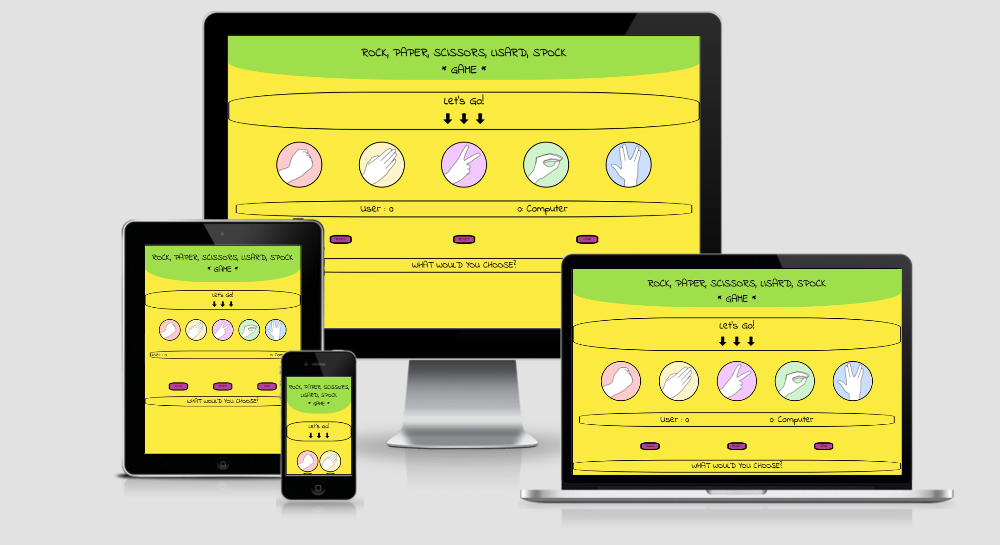
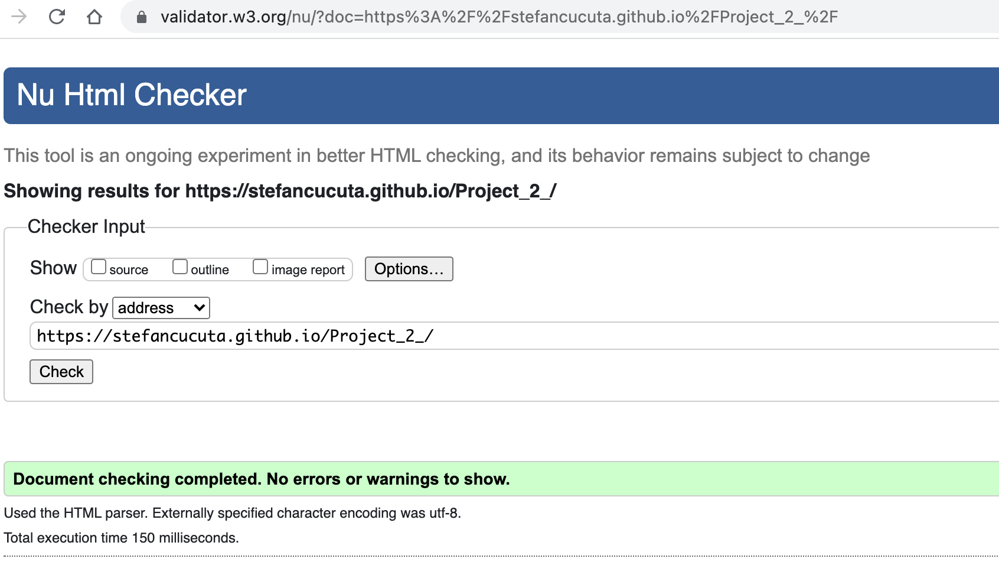
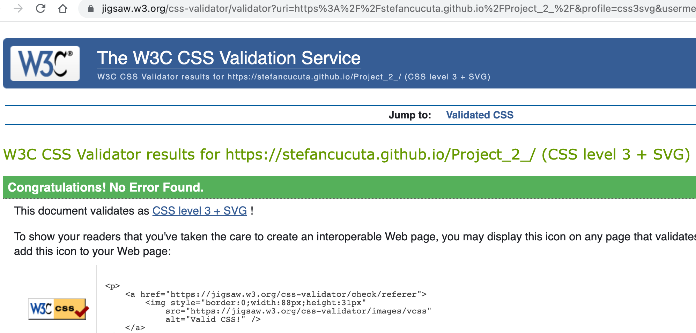
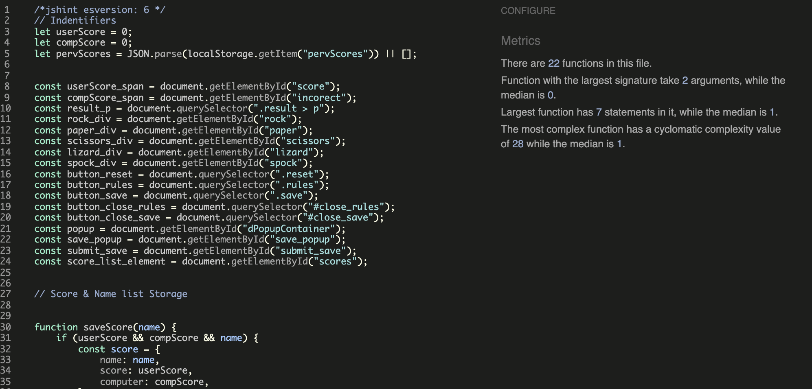
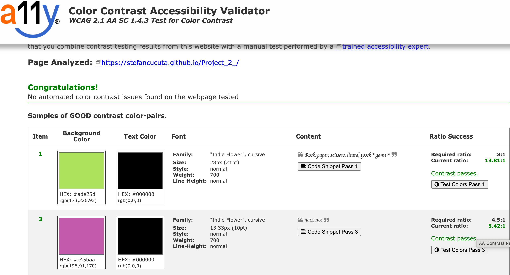

**Rock Paper Scissors Lizard Spock Game**

Rock paper scissors lizard spock is an extension of the classic game of chance, rock paper scissors, created by Sam Kass and Karen Bryla. Sam explains he created the expanded game because it seemed like most games of rock paper scissors with people you know would end in a tie.

***Game RULES***

"Scissors cuts paper, paper covers rock, rock crushes lizard, lizard poisons Spock, Spock smashes scissors, scissors decapitate lizard, lizard eats paper, paper disproves Spock, Spock vaporizes rock, and as it always has, rock crushes scissors."

 

**[Live DEMO]( http://stefancucuta.github.io/Project_2_/)**

- [UX](#ux) 
  - [User Stories](#user-stories)
    - [Strategy](#strategy)
      - [Main Goal](#main-goal)
    - [User Needs](#user-needs)
      - [Scope](#scope)
  - [Structure](#structure)
      - [Colour Palette](#colour-palette)
  - [Skeleton](#skeleton)
      - [Wireframes](#wireframes)
    - [Technology Used](#technology-used)
  - [Testing](#testing)
    - [Functionality Testing](#functionality-testing)
    - [Performance Test](#performance-test)
    - [Validator testing](#validator-testing)
  - [Accessibility](#accessibility)
  - [Compatibility](#compatibility)
  - [Unfixed Bugs](#unfixed-bugs)
  - [Deployment](#deployment)
  - [Credits](#credits)
      - [Media](#media)

- [Code](#code)

# UX
## User Stories

Rock, Paper, Scissors, Lizard, Spock game is created to be played between user and computer.

- top middle screen is displayed the game name. 
- under game name is displayed the game result depending what button has been chosed
- centre of the screen displays game area with five icons:  
  - 1st icon ROCK
  - 2nd icon PAPER
  - 3rd icon SCISSORS
  - 4th icon LIZARD
  - 5th icon SPOCK
 - under game area is displayed score area for user (left) and computer (right)
 - bottom centre of the screen is displayed the:
 - RULES button that will provide the rules of the game.
 - RESET button that will provide the option to reset the score.
 - SAVE button that will provide the option to save your score.

### Strategy

#### Main Goal
- attract people of all ages to play this game. 
- reach people who are interested to play against the computer.
- reach to people who want to play a fast, easy, and fun game.

### User Needs
#### Scope

- to have the option to be played everywhere.
- to provide instructions how to play the game.
- to have a responsive design on phone, tablet, and desktop.
- players to enjoy the experience playing this game.

## Structure
 - we aim that the game to be entertaining, easy to understand the rules and play. 
 - the interface responds to user actions as expected. 
 - all buttons respond normal when hovered and press (helps the user to quickly learn de functionality)
  
### Colour Palette 

  [COOLORS]( https://coolors.co) was used to extract the main colours for the website:
  
  

  ## Skeleton
### Wireframes 
 
- Landing page :  [mobile](assets/images/desktop.png) , [desktop](assets/images/mobile.png)

### Technology Used 
- HTML
- CSS
- JavaScript
- Libraries [Google Fonts] (https://fonts.google.com/specimen/Indie+Flower?query=indie)

## Testing

### Functionality Testing
### Performance Test 
  

  
### Validator testing
  * HTML
    - No errors were returned when passing through the   official [w3c html validator ] (https://validator.w3.org/).
  
  

  * CSS
    - No errors were found when passing through the official [w3c jigsaw validator ] (https://jigsaw.w3.org/css-validator/).
   
   

  * JavaScript
  
    - No errors were found when passing through the official [JSHINT](https://jshint.com/)
  
  .

  ### Accessibility

  Accessibility was tested with both Chrome Lighthouse [a11y contrast checker](https://color.a11y.com/)  and no issues were found. 

  
### Compatibility
  ### Unfixed Bugs
  - No bugs to be fixed

  ### Deployment

- Git Hub Pages
  
  - The project was deployed to GitHub Pages using the following steps:

   1 Log in to GitHub and locate the Rock Paper Scissors Lizard Spock Game Repository

   2 At the top of the Repository, locate and click the "Settings" Button on the menu

  3 Scroll down the Settings page until you locate the "GitHub Pages" Section.

  4 Under "Source", click the dropdown called "None" and select "main" branch.

  5 The page will automatically refresh.

  6 Scroll back down through the page to locate the now published [Project_2_]( https://stefancucuta.github.io/Project_2_/) in the "GitHub Pages" section.

### Credits
  
#### Media
   - Images used were taken from :
     - [PIKPNG]( https://www.pikpng.com/pngvi/Jhxmoi_pierre-ciseaux-feuille-lzard-spock-aligned-rock-paper/)
  - The image have been cropped, resized and compressed in order to boost the UX flow.
  
#### Code
[Love Maths Project](https://learn.codeinstitute.net/courses/course-v1:CodeInstitute+LM101+2021_T1/courseware/2d651bf3f23e48aeb9b9218871912b2e/234519d86b76411aa181e76a55dabe70/) by Code Institute as a general resource.

[W3School](https://www.w3schools.com/) as a general resource.

[Stackoverflow](https://stackoverflow.com/) as a general resource.

